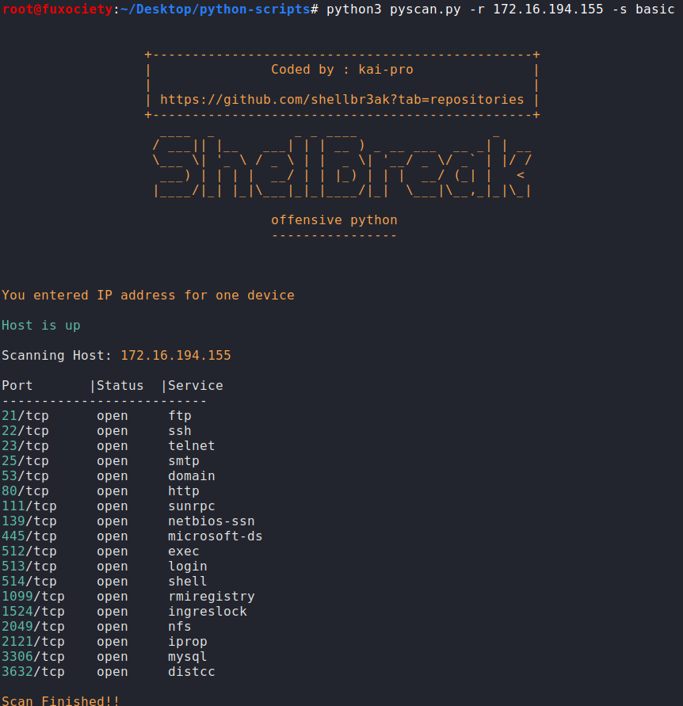

# PyScanner v1.0

I wrote this tool as an alternative of netdiscover tool, since I play CTF from VulnHub, sometimes I need to get the IP address
of the target machine on my own, and that's when I came up with this idea

-- The tool pings all the devices on the same network and prints the IPs of the accessible macines --
-- Additional port scanning can be done as well --

# Usage:
python3 pyscan.py -r 172.16.194.1/24 -s scan_type

# Example:
python3 pyscan.py -r 172.16.194.1/24 -s massive

## Single host scan can be done as well:
python3 pyscan.py -r IP -s scan_type

# Note: 
This tool works with python3 only

